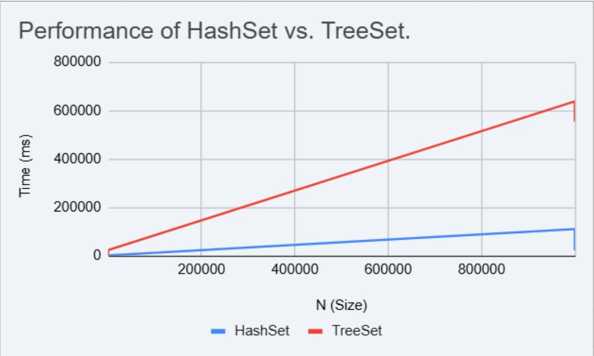

# Investigating Set Implementations: A Performance Analysis of HashSet vs. TreeSet

|                 |                                               |
|:----------------|:----------------------------------------------|
| **Author**      | Davinio Gonzalez Cruz                         |
| **Student ID**  |   500957514                                            |
| **Begeleider**  | Engelbert                                     |
| **For:**        | Onderzoekend Probleemoplossen                 |
| **Program**     | HBO-ICT                                       |
| **Institution** | HVA                                           |
| **Periode**     | Semester 1, 2025-2026                         |

---

## 1. Introduction

### 1.1 Problem Statement

In software development, choosing the correct data structure is important for building efficient and scalable applications. When a developer's requirement is to store a collection of unique elements, the Java Collection Framework (JCF) provides the Set interface. However, the JCF offers several implementations of this interface, most commonly HashSet and TreeSet.

A choice between these two can lead to consequences. For example, selecting the wrong implementation could result in severe performance bottlenecks, such as slow lookups in a large dataset, or being unable to retrieve data in a sorted order. On the other hand, choosing the right Set **implementation** can dramatically improve speed and efficiency. This presents a common challenge for junior developers who need to make an optimal decision.

### 1.2 Research Questions

To address this problem, this research aims to analyze the differences and practical outcomes of using HashSet versus TreeSet. The investigation is guided by the following main research question:

**Main Question: "How do the data structures of HashSet and TreeSet fundamentally change their speed for core operations (add, contains, remove), and what is the optimal scenario for both of them?"**

To answer this main question, the following sub-questions will be investigated:

* **SQ1:** What are the contractual guarantees of the Set interface?
* **SQ2:** How is HashSet internally implemented, what is its theoretical speed (Big O), and what is its behavior regarding order?
* **SQ3:** How is TreeSet internally implemented, what is its theoretical speed (Big O), and what is its behavior regarding order?
* **SQ4:** How do the measured results from a practical benchmark (Section 4) compare to the theoretical performance?

---

## 2. Theoretical Framework

### 2.1 The Set Interface (SQ1)

"The Set interface is a core part of the Java Collections Framework, designed to store a collection of unique elements. Unlike a List, a Set does not allow duplicates." (GeeksforGeeks, 2024)."

The primary "contract" of the Set interface is that it **does not allow duplicate elements**. This is its main functional difference from a List. If a user attempts to add an element that is already present in the set, the add() operation will simply return false and the set **will not be modified**. Unlike a List, the Set interface is not index-based. You cannot ask for "the 5th element," as the concept of a numerical index is not part of the Set's contract.

This leads to the central problem this research investigates: the Set interface, makes **no guarantee about order**. While it stores unique items, it doesn't promise to return them in any specific order. This design is intentional and it allows for implementations that prioritize different goals, and this is not a negative trait, it is a deliberate and useful design choice.

### 2.2 HashSet: Hashing and hashCode() (SQ2)

A HashSet is a hash table-based implementation of the Set interface. Its primary advantage is its consistent performance for operations.

A HashSet is a "wrapper" for a HashMap. When you add an object to a HashSet, that object is actually stored as a key in the internal HashMap, with a placeholder Object as its value (Oracle, 2024).

The mechanism that makes this work is called **hashing**. Think of a HashSet as a giant coat check room with a large number of numbered bins.

**hashCode() (Finding the Bin)**
When you give the cloakroom attendant your coat, for example, they don't search for an empty spot. Instead, they look at the object and instantly calculate a number using its hashCode() method. This number quickly tells them exactly which bin number to use.

**Storage & equals() (Handling Collisions)**
The attendant goes directly to that bin.
* If the bin is empty, they drop the coat in.
* If the bin already has a coat (or several) in it, a "collision" occurs. The attendant now uses the equals() method to compare the new coat to every coat already in that *specific* bin.
* If equals() returns true (a match is found), the coats are identical. Since the Set contract forbids duplicates, the new coat is rejected, and the add() operation returns false.
* If equals() returns false for all items in the bin, the new coat is different and is added to the bin alongside the others.

**Performance**
This "bin" system is what gives HashSet its great speed of **O(1)** (constant time) for add(), contains(), and remove() operations. The size of the Set (n) doesn't matter, the calculation to find the bin is always just one step.

**Ordering**
Because objects are stored in bins based only on their calculated hash code, there is **no guarantee of order**. "The iteration order of a HashSet is completely random and can even change as the set is resized. This is because it adds items based on their hash code, not their insertion order." (W3Schools)

### 2.3 TreeSet: Balanced Trees and Comparable (SQ3)

A TreeSet is a completely different implementation of the Set interface. Instead of prioritizing speed, its main purpose is to **store elements in a sorted order**.

Internally, a TreeSet is a "wrapper" for a TreeMap (Oracle, 2024). This TreeMap stores the elements in a structure called a **Red-Black Tree**, which is a special, self-balancing binary search tree.

We will use the analogy of a perfectly organized, alphabetical filing cabinet.

**Finding the Spot**
When you add a new file (an object), you don't just put it in a random drawer. You start at the beginning (the "root" of the tree) and compare it.

Let's say the root (the first drawer) is "Karthik", and you want to add "Engelbert":
1.  Compare "Engelbert" to "Karthik". "Engelbert" comes *before*. Go to the **left**.
2.  The left drawer is "Davinio". Compare "Engelbert" to "Davinio". "Engelbert" comes *after*. Go to the **right**.
3.  The right slot is empty. Insert "Engelbert" here.

This process of "go left" or "go right" is how the tree finds the exact spot.

**Comparable and Comparator (The Sorting Rules)**
How does the filing cabinet *know* that "Karthik" comes after "Engelbert"? It must have a set of rules.
* **Comparable:** This is the "natural order." The objects themselves know how to compare. For example, String objects know that "A" comes before "B", and Integer objects know that 5 comes before 10. If you add Strings to a TreeSet, it just works.
* **Comparator:** What if you want to sort by a different rule (like, sort strings by their *length* instead of alphabetically)? A Comparator is a separate object you provide that contains your custom rules.

If you add objects that don't have a Comparable rule, the TreeSet will crash, throwing an exception because it has no idea how to sort them.

**Performance (Big O)**
This comparison process is very fast, but it is **not** O(1). With each comparison, the TreeSet discards roughly half of the remaining elements. This is called **logarithmic time**, or **O(log n)**, for add(), contains(), and remove(). This is slightly slower than HashSet's O(1) because it has to do multiple "hops" to find the right spot. However, this O(log n) performance is extremely stable and scales well with large amounts of data.

**Ordering**
The entire purpose of this structure is **order**. A TreeSet is **always sorted** according to the rules (Comparable or Comparator). When you loop over a TreeSet, the elements will come out in perfect ascending order (1, 2, 3... or "A", "B", "C"...).
---

## 3. Methodology

### 3.1 Experimental Setup

To gather the practical data required to answer SQ4, a series of benchmarks was developed. The tests were conducted on the following system:

* **Hardware:** HP Victus (AMD Ryzen 5 3600X, 16GB RAM, NVIDIA GeForce RTX 4050)
* **Software:** Windows 10, IntelliJ IDEA, Java 17

### 3.2 Test Procedure

To answer **SQ4**, three distinct performance tests were created.

1.  **Add Operation:** Measured the time to add *N* randomly generated Integer objects to an empty set.
2.  **Contains Operation:** Measured the time to search for those same *N* objects in the now-full set.
3.  **Remove Operation:** Measured the time to remove those *N* objects from a re-filled set.

These three tests were run for both HashSet and TreeSet using the data sizes defined in the SIZES_TO_TEST array: **10,000**, **100,000**, and **1,000,000** elements.

For statistical reliability, each test was executed **10 times** (as defined by NUMBER_OF_RUNS). The final number recorded in the results is the **average** time (in milliseconds) of those 10 runs. A Random seed was used to ensure both (i picked 123 in my case), HashSet and TreeSet were tested with the exact same sequence of numbers, guaranteeing a fair comparison.

-----

## 4. Results

The benchmark tests described in the methodology were ran. The program ran each test 10 times and calculated the average for each operation, for each data size like mentioned before.

The console output from the program is as follows, with all times measured in **milliseconds (ms)**.

**Table : Average Operation Time (in milliseconds)**

| Set Type | N (Size) | Add (ms) | Contains (ms) | Remove (ms) |
| :--- | :--- | :--- | :--- | :--- |
| HashSet | 10,000 | 0.542 | 0.238 | 0.331 |
| TreeSet | 10,000 | 1.678 | 1.285 | 1.666 |
| HashSet | 100,000 | 9.686 | 1.461 | 1.476 |
| TreeSet | 100,000 | 27.053 | 25.754 | 23.631 |
| HashSet | 1,000,000| 110.142 | 29.556 | 22.673 |
| TreeSet | 1,000,000| 637.492 | 554.224 | 568.017 |

 

### 4.1 Visual Analysis (Chart)

To visually interpret this data, the data for the **Add Operation** was plotted on a line graph. Google Sheets was used for this with the upper Tabel:

The blue line (HashSet) is low and flat, which visually proves the speed HashSet has.

The red line (TreeSet) is steep and straight, which visually proves the O(log n) theory (it's much slower and scales with N).

---

## 5. Analysis

The data gathered in Section 4 clearly supports the theoretical foundations discussed in Section 2. The performance difference is not just theoretical, it is measurable, predictable, and visible in the results.

**Analysis of Table 1:**
* At every data size (10k, 100k, and 1M) and for every operation (add, contains, remove), the HashSet performance was a good bit faster than TreeSet.
* At N=1,000,000, the HashSet was **5.8 times faster** for add operations (110ms vs. 637ms) and an incredible **18.7 times faster** for contains operations (29ms vs. 554ms).

**Analysis of Chart 1:**
The line graph for the add operation visually confirms the Big O:

* **HashSet (Blue Line):** The line is relatively flat and low. While it does increase slightly (from 0.5ms to 110ms), its growth is not explosive. This probves that the "on-average" **O(1)** (constant time) complexity. The time to add an item is *not* strongly dependent on the size of the set.
* **TreeSet (Red Line):** The line is a steep, straight, upward-sloping line. This proves that the **O(log n)** complexity. As the set (N) gets bigger, the time to add a new element gets bigger because the "filing cabinet" (the tree) is deeper and requires more comparisons to find the correct spot.

In conclusion, the practical benchmarks aligns with the theory. HashSet is faster, and TreeSet's sorting feature comes at a clear and measurable performance cost.

---

## 6. Conclusion

### 6.1 Answering the Research Question

The main research question was: "How do the data structures of HashSet and TreeSet fundamentally change their speed and memory usage for core operations, and what is the optimal scenario for both of them?"

This research has shown that the underlying data structures are the real factors:
* **HashSet**, which uses a HashMap (hash table), relies on an object's hashCode() to find a "bin." This provides an **O(1)** average-time.
* **TreeSet**, which uses a TreeMap, relies on Comparable or Comparator to find the correct, sorted spot. This provides a guaranteed **O(log n)** speed.

The practical benchmarks in Section 4 confirmed our theory. The HashSet was faster in all add, contains, and remove tests, with its performance (as seen in Chart 1, and the graph) remaining relatively constant. The TreeSet's performance cost was clearly visible with its operation times growing as the data size increased.

The optimal scenarios are because of that, a trade-off between speed and functionality:
* The optimal scenario for **HashSet** is when maximum performance is the primary goal and element order is NOT important / usefull.
* The optimal scenario for **TreeSet** is when sorted order IS a functional requirement, and the developer is willing to accept the O(log n) performance cost to gain that feature.

### 6.2 Recommendations

Based on these findings, the following recommendations could be provided to developers:

**Use HashSet when:**
* You need the fastest possible performance for add, contains, and remove.
* You don't care about the iteration order of the elements.

**Use TreeSet when:**
* You MUST store and retrieve elements in a sorted order.
* You are willing to accept a slight performance overhead O(log n) to get this ordering.
* Typical Use Case: Leaderboards, calendars, displaying data alphabetically.

---

## 7. Bibliography

Baeldung. (2024, October 2). *HashSet vs. TreeSet in Java*. Baeldung. https://www.baeldung.com/java-hashset-vs-treeset

GeeksforGeeks. (2024, July 15). *Set interface in Java*. GeeksforGeeks. https://www.geeksforgeeks.org/java/set-in-java

Oracle. (2024). *HashSet (Java SE 17 & JDK 17)*. Oracle Help Center. Retrieved November 17, 2025, from https://docs.oracle.com/en/java/javase/17/docs/api/java.base/java/util/HashSet.html

Oracle. (2024). *TreeSet (Java SE 17 & JDK 17)*. Oracle Help Center. Retrieved November 17, 2025, from https://docs.oracle.com/en/java/javase/17/docs/api/java.base/java/util/TreeSet.html

W3Schools. *Java HashSet and TreeSets*. Retrieved November 17, 2025, from https://www.w3schools.com/java/java_hashset.asp
