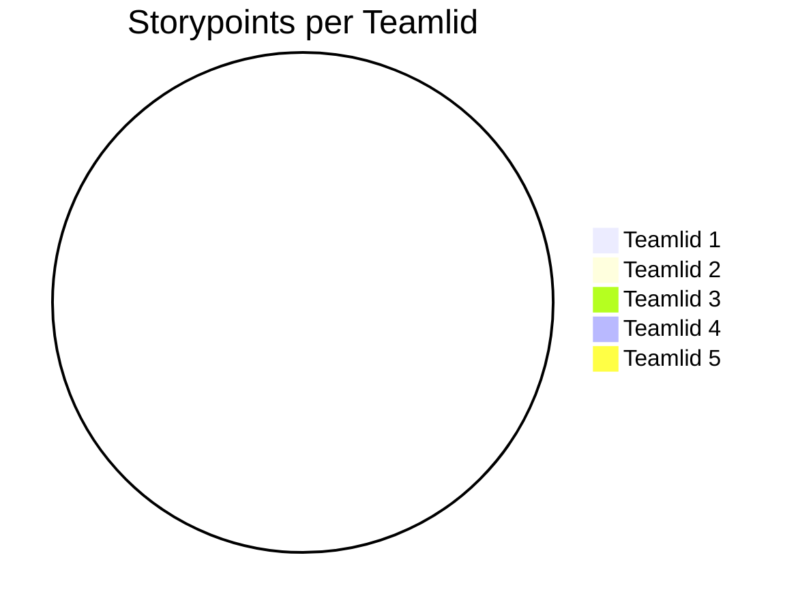

# Retrospective sprint 

// Alle tekst met // weghalen voordat je het op DLO zet. Zorg dat het document er verzorgd uitziet.

// De retrospective doe je met je team.

Doe de retrospective m.b.v. een van de manieren op https://www.funretrospectives.com/category/retrospective/

>> Formuleer op basis hiervan concrete verbeterpunten voor de komende sprint

>> Geef elkaar feedback op basis van gedrag in de afgelopen sprint.

| Well | Not Well | New Ideas |
|-------|----------|-------------|
| Everyone was easily reachable and responded quickly in the group chat | Sometimes we talk past each other, which makes agreements unclear | At the start of each meeting, give a short summary of what was agreed before |
| We helped each other whenever someone got stuck | Not everyone always takes the same level of initiative to share ideas | Assign fixed roles during meetings (leader, note-taker, timekeeper) |
| Tasks were divided fairly | Deadlines were not always clearly agreed upon or met | At the end of each meeting, define clear to-do’s with responsible persons |
| There was a positive and respectful atmosphere | Sometimes too many things are discussed at once, which makes it chaotic | Use a fixed agenda and limit the number of topics per meeting |
| Everyone was open to feedback | Sometimes feedback is handled too quickly without proper discussion | Plan structured feedback moments at the end of each sprint |

## Aandeel teamleden

// Geef per teamlid aan hoeveel storypoints of werk hij/zij deze sprint heeft kunnen realiseren. Vervang hieronder de namen van de teamleden en geef per teamlid het aantal storypoints. De mermaid code genereert vervolgens een pie-chart. 

// Geef onder de pie chart een korte toelichting: wat valt op?  Kunnen jullie de verschillen verklaren?

## Feedback voor teamleden

// Geef hieronder zo specifiek mogelijke feedback voor elk teamlid.

// tip: bereid de feedback op je teamleden eerst individueel voor en ga dan pas samen zitten.

// herhaal onderstaande kopjes voor elk teamlid.

### Feedback teamlid

#### Tops

## Suleyman:
We can count on you, you bring a positive atmosphere

## Zarko:
You work efficiently, you are eager to help

## Davinio:
You are always there and show motivation

## Baran:
You bring positive energy, you are a real go-getter

### Tips

## Suleyman:
You could be more active outside of school, and read the projects more carefully so you know better what needs to be done

## Zarko:
Try to share your ideas more often, and make your communication clearer

## Davinio:
Pay more attention to details in your work, and try to take breaks so you stay sharp

## Baran:
Keep a closer eye on your planning, and try to ask for feedback from the team more often

##### Eigen reflectie

#### Davinio:

Tijdens sprint 1 heb ik veel gewerkt aan het voorbereiden van de design, en het plannen van Sprint 2. Ik heb met mijn team een Figma design gemaakt die goedgekeurd was, en we zijn begonnen aan het opstellen van de UserStories die nog goedgekeurd moeten worden door onze PO. Aan de hand van mijn werk in sprint 1 heb ik ook feedback ontvangen van mijn team (zie "Feedback voor teamleden"). Als TOP heb ik gekregen: "Je bent er altijd en laat motivatie zien". Ik ben blij dat ik in de korte sprint dit heb kunnen laten zien. Ik zal op deze manier doorgaan in de komende sprints. Als TIP heb ik gekregen:"Let wat meer op details bij je werk, probeer soms ook rust te nemen zodat je scherp blijft". Ik heb op dit gereflecteerd, en heb besloten dat ik vanaf de komende sprint meer op de details ga letten, en ook niet te snel werk waardoor ik fouten verminder. 

#### Zarko:

Mijn ontwikkeldoel is om mijn communicatie en het delen van ideeën te verbeteren. Ik merk dat ik vaak efficiënt werk en anderen graag help, maar dat ik mijn eigen gedachten en voorstellen soms te weinig uitspreek.  

**Concreet ga ik hier in de komende sprint aan werken door:**
- Minimaal een keer per week een idee of suggestie actief te delen tijdens het teamoverleg.  
- Mijn updates en voortgang duidelijk te communiceren in onze groepschat.  
- Aan het einde van elke week te vragen of mijn uitleg duidelijk genoeg was, zodat ik daar feedback op kan krijgen.  

**SMART doel:**  
Aan het einde van deze sprint wil ik aantoonbaar minstens vier keer actief mijn ideeën hebben gedeeld in het teamoverleg en teruggekoppeld hebben gekregen dat mijn communicatie duidelijker is geworden. 

->>>>> DLO, upload per persoon op de DLO een doc. 

Noem deze retrospective sprint + nummer (zodat we weten waar het over gaat)
