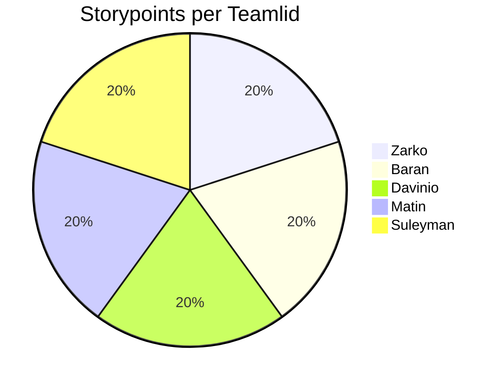

# Retrospective sprint 1

## Proportion team members

## Feedback for team members

### Tops

#### Suleyman:
You deliver reliable work.

#### Zarko:
You're an excellent motivator and very encouraging.

#### Davinio:
You often take the reins.

#### Baran:
You often offered to do open tasks.

#### Matin:
You communicated a lot more with the team this sprint.

### Tips

#### Suleyman:
Appear on time.

#### Zarko:
Stick closer to the planning to avoid stress and last-minute conflicts. Start on the work sooner.

#### Davinio:
Give the team updates on your progress more frequently.

#### Baran:

#### Matin:
Stick closer to the planning to avoid stress and last-minute conflicts. Start on the work sooner.

## Personal Reflections  

### Baran

---

### Davinio  

---

### Sprint Reflection – Zarko

During this sprint, I received positive feedback that I was very motivating and brought a lot of energy to the team. I’m glad that my enthusiasm helped to keep team morale high and encouraged collaboration. I believe maintaining a positive attitude within the group is one of my strengths, as it helps us stay productive and engaged, especially when facing challenges.  

However, one point for improvement was that I should stick to the planning more closely to prevent potential issues. I noticed that sometimes I focused too much on helping others or working on multiple tasks at once, which made it harder to follow the original plan strictly. This occasionally led to minor delays or last-minute adjustments.  

To improve this, I’ve created the following **SMART goal** for the next sprint:  

> **I want to stick to my planning more consistently by reviewing and updating my tasks during every stand-up meeting, so that I stay on track with deadlines and avoid last-minute issues. I will evaluate my progress in each stand-up by checking whether I’m up to date with my planned tasks.**

By doing this, I aim to maintain my motivating presence in the team while becoming more structured and reliable in my task management. Regularly reflecting on my progress during stand-ups will help me stay organized and ensure that my positive energy also contributes to better planning and smoother teamwork.

---

### Suleyman
The tip recieved last sprint was that I should be more active on communicating outside of school. I think I greatly improved in this area and replied more often to messages in the groupchat. An area I could improve on is the work process since I didn't update the sprintboard often enough.\

As a TOP I received:"You deliver reliable work" It is good to hear the work I produce is considerd reliable. I would like to keep this going and improve it nexr sprint by delivering work faster.

As a TIP I received:"Appear on time" I recognize that appearing on time is important for team collaboration and planning, so I will make sure to arrive on time for meetings and work sessions.

SMART Learning Goal:
By the end of the next sprint (in two weeks), I will update the sprint board at least twice per week and check the group chat daily to ensure consistent communication and transparency about my progress. I will also make sure to be on time for every meeting to strengthen my reliability within the team.
---

### Matin