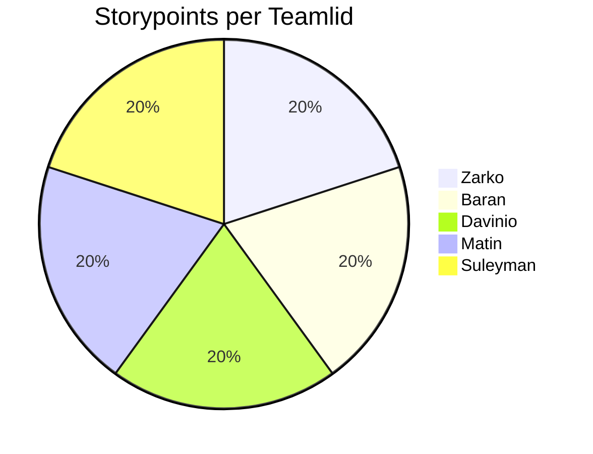

| Well                                                                                             | Not Well                                                                | New Ideas |
|--------------------------------------------------------------------------------------------------|-------------------------------------------------------------------------|-------------|
| Everyone was easily reachable and responded quickly in the group chat just like previous sprints | Contact with Product owner was practically none exitent.                | Unit tests, can be added to CI/CD|
| We helped each other whenever someone got stuck and the "vibe" in the team was possitve.         | We still have to many brenches.                                         | Infra & Docker & Deployen & CI/CD |
| Tasks were divided fairly, and we made enough amount of user stories.                            | Improve UI/UX with TMC and look at Accessability                        | Chat is also coming up |
| We improved the daily stand-ups, and we focused more on our documentation.                       | Sometimes too many things are discussed at once, which makes it chaotic | Use a fixed agenda and limit the number of topics per meeting |
| Everyone was open to feedback and easy going.                                                    | 4 a 5 dagen per week aan studie besteden                                | Plan checkup moments at the end of each sprint before delivering the work |

# SMART Learning Goals – Team Level
 
---

## 1. Improve Sprint Planning & Task Start Time

**Specific:** The team will begin assigned tasks within 24 hours after the sprint planning meeting.

**Measurable:** At least 90% of tasks will be moved to “In Progress” or even “Done” within the first few days of the sprint.

**Achievable:** By improving clarity in sprint planning and assigning tasks early, this is realistic.

**Relevant:** Early task initiation helps prevent last-minute stress and workload imbalance.

**Time-bound:** To be achieved consistently starting in Sprint 3 and evaluated at the next retrospective.
 
---

## 2. Strengthen Communication & Transparency

**Specific:** Each team member will update the sprint board and post a short progress message in the group chat at least twice per week.

**Measurable:** The board should reflect active updates from all five team members weekly.

**Achievable:** These updates require minimal time and can be done during stand-ups or at the end of the workday.

**Relevant:** Improves alignment, reduces misunderstandings, and supports teamwork.

**Time-bound:** Implemented for the duration of Sprint 3 and reviewed during the next retrospective.
 
---

## 3. Enhance Time Management & Reliability

**Specific:** The team will collectively ensure that all sprint tasks are completed by 24 hours before the sprint review to allow time for testing and adjustments.

**Measurable:** At least 90% of sprint tasks will be marked as “Done” one day before the sprint review.

**Achievable:** With better planning and communication, this timeline is realistic.

**Relevant:** Reduces last-minute stress and improves the quality of deliverables.

**Time-bound:** To be achieved in Sprint 3, evaluated in the Sprint 3 Retrospective.

 
## Davinio's reflection

During Sprint 3, I continued to build on my development tasks and focused on improving my workflow within the team. This sprint, I made sure to complete my user stories on time and stayed consistent with the planning we created together. I also paid more attention to the merging process, ensuring that my code was of good quality before submitting a merge request.

One point of feedback I received was a reminder to communicate more clearly when making or verifying merge requests. In the previous sprint, I sometimes informed only one teammate, which could slow down the reviewing process. Moving forward, I will make sure to notify the entire team so that everyone stays aligned and reviews can happen more efficiently.

This sprint also helped me become more confident in handling tasks independently while still staying connected with the group. I took more initiative in certain areas, but I also learned the importance of keeping everyone in the loop to maintain smooth teamwork.

**TOP**

* You have your user stories done and closed on time, and you follow the plannings.
* I took initiative when needed and helped keep the project moving forward.
* I maintained steady communication about my progress throughout the sprint.
* I was reliable when it comes to explaining what ive learned, such as working with the database.

**TIP**

* “When making and verifying a merge request, make sure to let the whole team know instead of just one person.”
* Ask for feedback earlier in the development process to prevent last-minute changes.
* Involve teammates more when making decisions that affect the project.
* Continue refining time management by breaking tasks into smaller steps to stay ahead of deadlines.

---
# Reflections

